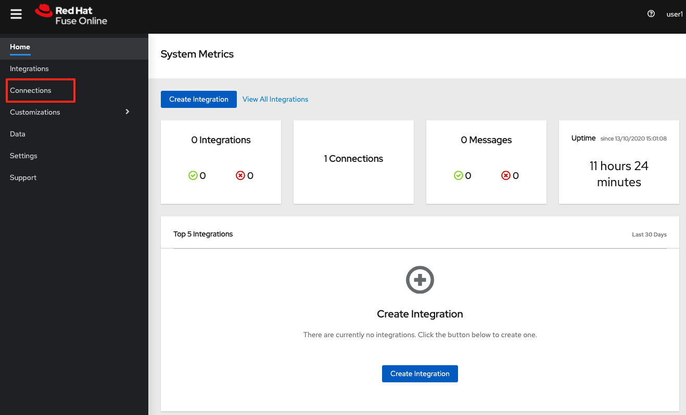
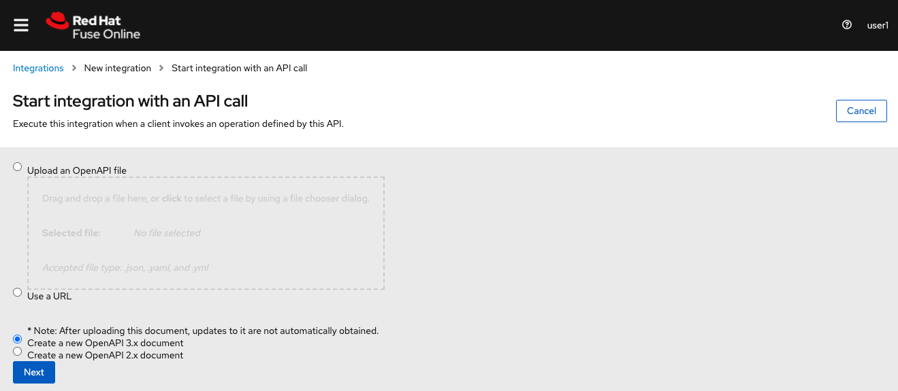

// Attributes
:walkthrough: API Management
:title: Lab 4 - {walkthrough}
:user-password: openshift
:standard-fail-text: Verify that you followed all the steps. If you continue to have issues, contact a workshop assistant.
:namespace: {user-username}

// URLs
:fuse-user-url: https://syndesis-fuse-{user-username}.{openshift-app-host}/

[id='api-management']
= {title}

As part of the acquisition, your team at International Inc's is now working with Fleur de Lune's IT department to learn more about Event-Driven Architecture or EDA. By applying event-driven concepts you will help to avoid classic problems derived from coupled synchronous service calls and avoid the need to implement additional infrastructure components. 

The first step was to migrate their ecommerce orders website from a legacy SpringBoot stack to the new supersonic subatomic Quarkus-based microservices. However, they have been dealing with a high rate of errors because one of the components is crashing frequently. To overcome this, you will need to create a new event bus using self-service messaging and implement new event-driven services and APIs using a highly productive iPaaS suite. You will then need to wire everything together to showcase to upper management how EDA solves some of the problems that came along pure REST APIs.

*Audience:* Enterprise Integrators, System Architects, Developers, API Designers, Data Integrators

*Overview*

AMQ self-service messaging enables developers to provision messaging when and where they need it via a web-based browser. You will create your own personal space to create events destinations that will be used by your applications with different patterns like queues and topics.

image::images/lab1-overview.png[Overview, role="integr8ly-img-responsive"]

Red Hat Integration includes an integration Platform-as-a-Service (iPaaS) solution that makes it easy for business users to collaborate with integration experts and application developers. It is a full toolchain and runtime, available right from your browser. You will use this tool to design and implement a new API service and to connect with the Event bus provided by AMQ Online.

*Why Red Hat?*

The Red Hat portfolio of middleware products helps you create a unified environment for application development, delivery, integration, and automation. It is comprised of comprehensive frameworks, integration solutions, process automation, runtimes, and programming languages.

To respond to business demands quickly and efficiently, you need a way to integrate applications and data spread across your enterprise. Red Hat AMQ —based on open source communities like Apache ActiveMQ and Apache Kafka— is a flexible messaging platform that delivers information reliably, enabling real-time integration and connecting the Internet of Things (IoT).

AMQ Online is a solution (Operator) to manage multiple components to provide the overall functionality of running self-service (Messaging as a Service) messaging platform on OpenShift. With AMQ online, developers can provision messaging when and where they need it through a browser console. The AMQ online component is built on the foundation of Red Hat OpenShift, a container platform for high scalability and availability of cloud-native applications.

*Credentials*

Use the following credentials to login into the web consoles:

* Your *username* is: `{user-username}`
* Your *password* is: `{user-password}`

[type=walkthroughResource,serviceName=codeready]
.Red Hat CodeReady Workspaces
****
* link:{codeready-url}[Console, window="_blank", , id="resources-codeready-url"]
****
[type=walkthroughResource]
.Red Hat OpenShift Developer Console
****
* link:{openshift-host}/topology/ns/{namespace}[Topology View, window="_blank"]
****

:sectnums:

[time=5]
[id="Getting Ready"]
== Getting ready for the labs

[IMPORTANT]
====
Please complete the following instructions to get ready for this lab. *If this is not the first lab you are doing today, and you have already completed this step in any of the previous labs, please skip to next task*.
====

=== Login into the OpenShift cluster

. Finally, you will need to login into the OpenShift CLI to start interacting with the platform. For login, issue the following command:
+
[source,bash,subs="attributes+"]
----
oc login -u {user-username} -p {user-password} https://$KUBERNETES_SERVICE_HOST:$KUBERNETES_SERVICE_PORT --insecure-skip-tls-verify=true
----

. You should see something like the following (the project names may be different):
+
----
Login successful.

You have access to the following projects and can switch between them with 'oc project <projectname>':

    shared-db-earth
    shared-kafka-earth
  * user1
    user1-che
    user1-dayinthel-0605
    user1-shared-475f

Using project "user1".
Welcome! See 'oc help' to get started.
----

. Most of the work will be deploy to your own `{namespace}` project namespace, so be sure to have it as a _working_ project by executing the following command:
+
[source,bash,subs="attributes+"]
----
oc project {namespace}
----

. Now you are ready to start working on the application services.

Demo showing Fuse Online and 3Scale. This guide was based on [Rodrigo Ramalho demo](https://gist.github.com/hodrigohamalho/a52dfb24383c89b4c6b1022123e195f2).

We will create and expose an API that get data from a posgresql database using Fuse Online. After that, we'll expose it through 3Scale.

> No code is necessary for this demo

== Slides

* https://docs.google.com/presentation/d/1MNQHqjj4XZAe7WWRiByu5VTzKuSK3-s-ZBL5uP2Sp-8/edit#slide=id.g5892f11135_0_756

== Links

* 3Scale Dashboard Samples: https://rramalho-admin.3scale.net
* Apicurio: https://www.apicur.io/
* Microcks: http://microcks.github.io/
* Syndesis Extensions: https://github.com/syndesisio/syndesis-extensions

== Pre-req

#== Integrately Environment

You need to create an integrately environment

#== Creating database on Openshift

First, login to Openshift using a token.

image::images/07.png[]

And then copy to clipboard your login command


Now, let's create a new database in a project named `fuse-demo`:

[source,java,subs="attributes+"]
----
# Create new project on Openshift
oc new-project fuse-demo

# Create a new postgresql database using a Openshift template
oc new-app --template=postgresql-persistent --param=POSTGRESQL_PASSWORD=redhat --param=POSTGRESQL_USER=redhat --param=POSTGRESQL_DATABASE=sampledb -n fuse-demo
----

When the pod is ready, run:

```bash
# Get postgresql pod name
POD_POSTGRESQL=$(oc get po | grep postgresql | awk '{print $1}')

# Create database
oc exec -it $POD_POSTGRESQL -- bash -c 'psql -U redhat -d sampledb -c "CREATE TABLE users(id serial PRIMARY KEY,name VARCHAR (50),phone VARCHAR (50),age integer);"'

# Populate the database
oc exec -it $POD_POSTGRESQL -- bash -c "psql -U redhat -d sampledb -c \"INSERT INTO users(name, phone, age) VALUES  ('Rodrigo Ramalho', '(11) 95474-8099', 30);\""
oc exec -it $POD_POSTGRESQL -- bash -c "psql -U redhat -d sampledb -c \"INSERT INTO users(name, phone, age) VALUES  ('Thiago Araki', '(11) 95474-8099', 31);\""
oc exec -it $POD_POSTGRESQL -- bash -c "psql -U redhat -d sampledb -c \"INSERT INTO users(name, phone, age) VALUES  ('Gustavo Luszczynski', '(11) 95474-8099', 29);\""
oc exec -it $POD_POSTGRESQL -- bash -c "psql -U redhat -d sampledb -c \"INSERT INTO users(name, phone, age) VALUES  ('Rafael Tuelho', '(11) 95474-8099', 55);\""
oc exec -it $POD_POSTGRESQL -- bash -c "psql -U redhat -d sampledb -c \"INSERT INTO users(name, phone, age) VALUES  ('Elvis is not dead', '(11) 95474-8099', 36);\""

# Make sure your data is saved
oc exec -it $POD_POSTGRESQL -- bash -c "psql -U redhat -d sampledb -c \"select * from users;\""
```

> If for some reason you need to reinstall the database, just run:

[source,java,subs="attributes+"]
----
oc delete all -l app=postgresql-persistent -n fuse-demo
oc delete pvc postgresql -n fuse-demo
oc delete secret postgresql -n fuse-demo
----

=== Creating a Database Connection on Fuse Online

Open your tutorial page: https://tutorial-web-app-webapp.apps.latam-3a88.openshiftworkshop.com

> Update this url `https://tutorial-web-app-webapp.apps.latam-3a88.openshiftworkshop.com` according to your environment

Open Fuse Online

image::images/01.png[]

Click on `Connections`



Click on `Create Connection`

image::images/03.png[]

Then, select `Database`

image::images/04.png[]

Fill the database configuration with the following values:

```properties
url: jdbc:postgresql://postgresql.fuse-demo:5432/sampledb
user: redhat
password: redhat
```

image::images/05.png[]

Now, click on `Validate` to make sure everything is working as expected. If it is all good, click on `Next`.


The Connection Name is: `Users Database`. Then, click on `Create`

image::images/06.png[]

Now you should see connection `Users Database` listed in the connections page.

image::images/10.png[]

We are good to go for our API creation demo.

== Demo

#== Create an API from Scratch

Back to our `Home` page, click on `Create Integration`

image::images/11.png[]

Then select `API Provider` from the connections listed.

image::images/12.png[]

Choose `Create from scratch`



Click on `Add a data type`

image::images/14.png[]

Give it a name like: `User`

image::images/15.png[]

Paste the following json example and choose `REST Resource`. Then, click `Save`.

```json
{
    "id": 0,
    "name": "Rodrigo Ramalho",
    "phone": "11 95474-8099",
    "age": 30
}
```

Click `Save` again.

image::images/16.png[]

Now, click on `Next`

image::images/17.png[]

And give a name for our integration: `Users API`. Click on `Save and continue`

image::images/18.png[]

##== Creating an API for `Get All Users` (GET)

Create now a flow for the GET Method that list all users:

image::images/19.png[]

Add a step in our flow clicking on `+`:

image::images/20.png[]

Now choose our `Users Database` connection created previously.

image::images/21.png[]

Click on `Invoke SQL to obtain, store, update or delete data`:


Fill the `SQL Statement` with: `select * from users` and then click `Next`

image::images/23.png[]

Add a log step in our flow. Click again on the `+`:

image::images/24.png[]

Then choose `Log`

image::images/25.png[]

In the `Custom Text`, write `Loading users from database` and click `Done`.


Now, let's add a data mapping to our flow. In the last step, click in the yellow icon and then go to `Add a data mapping step`.

image::images/27.png[]

Expand both panel clicking on the arrows:

image::images/28.png[]

Now, drag and drop the source fields matching with the target fields and then click on `Done`.

image::images/29.png[]

Click now on `Save`.

image::images/30.png[]

##== Creating API for `Create a users` (POST)

From the combobox `Operations`, choose `Create a users`:


Repeat the same steps you did when `Creating an API for Get All Users (GET)`

When adding the Users Database, you need to click on `Invoke SQL to obtain, store, update or delete data` and add `INSERT INTO USERS(NAME,PHONE,AGE) VALUES(:#NAME,:#PHONE,:#AGE);` in the field `SQL statement`.

image::images/32.png[]

Also, during the data mapping you won't need to associate the `id` field because it will be already generate by the postgres database.


In the end, you should have something like:

image::images/34.png[]

Now, click on `Save` and then on `Publish`

image::images/35.png[]

Now, we need to wait Openshift build our container. When done, you should see `Published version 1` on the top of the page.

If you go to the `Home` page, we have 1 integration running.

image::images/37.png[]

Our last step is to expose our integration on Openshift using `Route`s.

```bash
oc create route edge i-users-api --service=i-users-api -n fuse
```

#== Testing your integration

You can check if your integration is working properly running:

```bash
curl https://$(oc get route -n fuse | grep i-users-api | awk '{print $2"/users"}')
```

Or you can try with [httpie](https://httpie.org/):

```bash
http https://$(oc get route -n fuse | grep i-users-api | awk '{print $2"/users"}')
```

#== Exposing your API using 3Scale

##== Importing API from Openshift

First, let's import our API from Openshift. To do that, just click on `NEW API`.


Select `Import from Openshift`. Then choose `fuse` for the `Namespace` combobox and `i-users-api` for the `Name` field. Click on `Create Service`.

image::images/39.png[]

Now you should see your new api on the 3scale dashboard.

image::images/40.png[]

##== Creating an application plan for our API

We need to create an application plan for our users api. Click on `Dashboard` menu and then on `i-users-api`

image::images/41.png[]

Now, click on `Create Application Plan`.

image::images/42.png[]

For the `Name` field use: `Basic Plan`. And for the `System name`: `basic-plan`. Now click on `Create Application Plan`.

image::images/43.png[]

We need to publish our application plan. To do that, click on `Publish`

image::images/44.png[]

##== Creating an application for our API