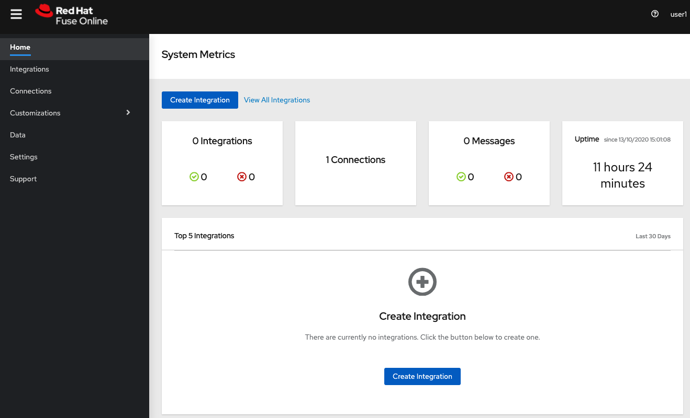
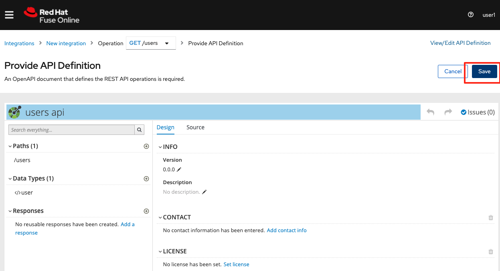
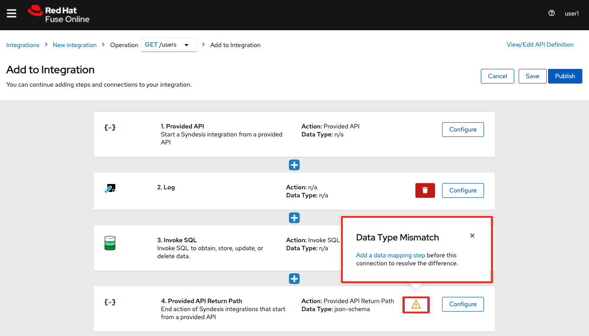
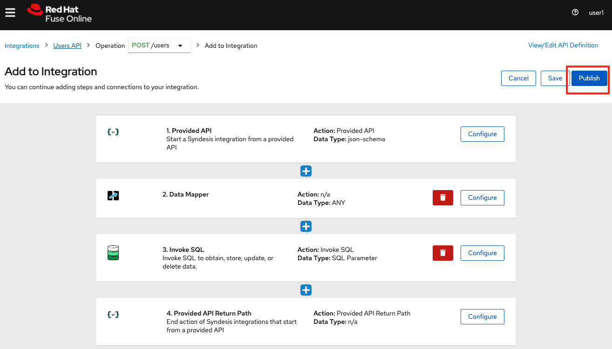
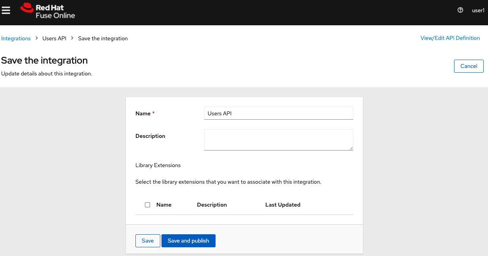
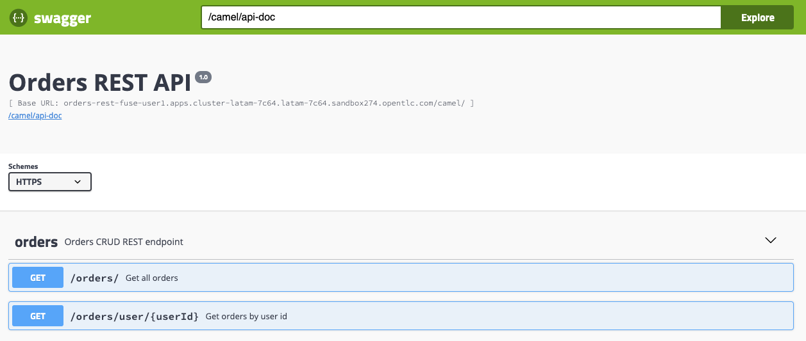

// Attributes
:walkthrough: API Management
:title: Lab 4 - {walkthrough}
:user-password: openshift
:standard-fail-text: Verify that you followed all the steps. If you continue to have issues, contact a workshop assistant.
:namespace: {user-username}

// URLs
:fuse-user-url: https://syndesis-fuse-{user-username}.{openshift-app-host}/
:3scale-user-url: https://{user-username}-admin.{openshift-app-host}/
:3scale-user-devportal: https://{user-username}.{openshift-app-host}/

[id='api-management']
= {title}

As part of the acquisition, your team at International Inc's is now working with Fleur de Lune's IT department to learn more about low code integration development and API Management. You are assigned on a mission to offer total 
control of the APIs as security, rate limit, and monetization through a centralized management interface for the APIs existent
on the International Inc. 

To see how it will work on the entire environment, you must implement a first and basic service called users API. 
So you are going to develop a microservice that retrieve users and orders information from a Postgre database and expose it as API, 
Therefore, you will set it up on the API Management platform to have control and visibility about this API. 

*Audience:* Enterprise Integrators, System Architects, Developers, API Designers, Data Integrators

*Overview*

API Products and Backends

image::images/00-lab-overview-02.png[Overview, role="integr8ly-img-responsive"]

API consume flow through available Application Plans

image::images/00-lab-overview-03.png[Overview, role="integr8ly-img-responsive"]

*Credentials*

Use the following credentials to login into the web consoles:

* Your *username* is: `{user-username}`
* Your *password* is: `{user-password}`

For the 3Scale API Management you are going to use *redhat* as password.

[type=walkthroughResource]
.Fuse Online
****
* link:{fuse-user-url}[Fuse Online Console, window="_blank", , id="resources-fuse-user-url"]
****
[type=walkthroughResource]
.3Scale API Management
****
* link:{3scale-user-url}[3Scale API Management, window="_blank", , id="resources-3scale-user-url"]
****
[type=walkthroughResource]
.Red Hat OpenShift Developer Console
****
* link:{openshift-host}/topology/ns/{namespace}[Topology View, window="_blank"]
****

:sectnums:

[time=15]
== Creating the Users API using the Low code Integration Solution Fuse Online

In order to create the Users API, first we need to manage to connect with the Users database.

=== Creating the connection with the Users Database

. Open link:{fuse-user-url}[Fuse Online Console, window="_blank"] and log in with the credentials `{user-username}` `{user-password}` and accept the permission grant.
+
image::images/01.png[Fuse Online Access, role="integr8ly-img-responsive"]
image::images/01-2.png[Fuse Online Access, role="integr8ly-img-responsive"]

. Now that you are on the iPaaS solution Red Hat Fuse, Click on `Connections`
+

. Click on `Create Connection`
+
image::images/03.png[Fuse Online Database Connection, role="integr8ly-img-responsive"]

. Filter for `database` and select the `Database` connection
+
image::images/04.png[Fuse Online Database Connection, role="integr8ly-img-responsive"]

. Fill the database configuration with the following values:

* `Connection URL`: `jdbc:postgresql://postgresql.fuse-{user-username}:5432/sampledb`
* `Username`: `redhat`
* `Password`: `redhat`

+
+
image::images/05.png[]

. Now, click on `Validate` to make sure everything is working as expected. If it is all good, click on `Next`.

. Fill `Users Database` for the *Connection Name*. Then, click on `Create`
+
image::images/06.png[]

. Now you should see connection `Users Database` listed in the connections page.
+

=== Design and Create the Users API from Scratch

Now the we have the Users database already configured as a valid connection, we will create the connection to interact with this database and export it as a REST API.

. On the side menu `Integrations`, select `Create Integration`
+

. Select `API Provider` from the connections listed.
+

. Choose `Create from scratch`
+
image::images/13.png[]

. Give it a name:
+
image::images/14-1.png[]

. Click on `Add a data type`
+
image::images/14.png[]

. Fill the *Name* field with the value `user` and paste the following JSON and choose `REST Resource`. Then, click `Save`. ** PLEASE DO NOT COPY USING THE PLUGIN **
+
[source,json,subs="attributes+"]
----
{
    "id": 0,
    "name": "Rodrigo Ramalho",
    "phone": "11 99555-2211",
    "age": 30
}
----
+

. Click `Save` again.

. Please take a look and see that all the CRUD REST operations (GET, POST, PUT, AND DELETE ) are already created for you with the attributes well defined and the data types inferred from the json model that we provided a model. We will implement *just two of them*. The *GET method retrieves all the users and the *POST to create a new user*. So, please remove the other methods.

. Select `/users/{userid}` and do a `Right Click` and select `Delete` option. 
+
image::images/16-1.png[]

. Your API Specification must look like that
+

. Click on `Next`
+
image::images/17.png[]

=== Creating an API for `Get All Users` (GET)

In the previous step, we managed to create all the API Specification using a friendly UI based on the open-source project *Apicurio*. 
Now that we defined which are the contract of our API, let's start the development of each method, that in Fuse Online, we call it 
as a *Flow*. 

We will implement *just two of them*. The *GET method retrieves all the users and the *POST to create a new user*.

. Create a flow for the GET Method that list all users:
+

. Add a step in the flow clicking on `+`:
+
image::images/20.png[]

. Choose the `Users Database` connection created previously.
+

. Click on `Invoke SQL to obtain, store, update or delete data`:
+
image::images/22.png[]

. Fill the `SQL Statement` with: `select * from users` and then click `Next`
+
image::images/23.png[]

. Let's add a log step for debug purposes in our flow. Click again on the `+`:
+

. Then choose `Log`
+
image::images/25.png[]

. In the `Custom Text`, write `Loading users from database ${body}` and click `Done`.
+
image::images/26.png[]

. Can you see a warning showing that we have a mapping conflict? In order to solve it, let's add a `data mapping` to our Flow. 

. In the last step, click in the yellow icon and then go to `Add a data mapping step`.
+

. Expand both panel clicking on the arrows, drag and drop the source fields matching with the target fields and then click on `Done`.
+
image::images/29.png[]

. Click now on `Save`. Please pay attention not to publish! Otherwise, you will have to wait for the publishing process to finish.
+
image::images/30.png[]
+
image::images/30-1.png[]

=== Creating API for Create a user (POST)

. From the combobox `Operations`, choose `Create a users`:
+
image::images/31.png[]

. Repeat the same steps you did on the previous step: `Creating an API for Get All Users (GET)`

. When adding the Users Database, you need to click on `Invoke SQL to obtain, store, update or delete data` and add `INSERT INTO USERS(NAME,PHONE,AGE) VALUES(:#NAME,:#PHONE,:#AGE);` in the field `SQL statement`.
+

. Also, during the data mapping you won't need to associate the `id` field because it will be already generate by the postgres database.
+
image::images/33.png[]

. In the end, you should have something like:
+

. Click on `Publish`
+

. Save and Publish!
+

We need to wait Openshift build and deploy our container. When done, you should see `Published version 1` on the top of the page.

. Go to the `Home` page, and look that is one integration running.
+
image::images/37.png[]

=== Testing your integration

You can check if your integration is working properly running clicking on `View` Integration and Copy and the External URL.

. With the URL in hand, try to do a GET on the /users endpoint. If you ysed exactly the same name suggested previously, the url will be:
+

link:https://i-users-api-fuse-{user-username}.apps.cluster-latam-7c64.latam-7c64.sandbox274.opentlc.com/users[https://i-users-api-fuse-{user-username}.apps.cluster-latam-7c64.latam-7c64.sandbox274.opentlc.com/users, window="_blank", , id="get-user-api"]

. To test the add user method (POST), try the following command in your terminal or the HTTP client of your preference:
+
[source,bash,subs="attributes+"]
----
  curl -X POST -H "Content-Type: application/json" https://i-users-api-fuse-{user-username}.apps.cluster-latam-7c64.latam-7c64.sandbox274.opentlc.com/users -d '{"name": "myname", "age": 20, "phone": "61 3323-2314"}'
---- 

. Also, take a look into the logs into the new deployed application, it's a Apache Camel microservice. All the work that we have done so far through this righ GUI it's generating Camel routes, if you look in details you can see by the logs that the API Specification is available on the `/openapi.json` endpoint.

[type=verification]
Could you see the list of users returned by the `/users` endpoint?

== Exposing the Users API through Red Hat 3Scale API Management

First, to get familiarized with 3Scale, let's open the link:{3scale-user-url}/p/admin/onboarding/wizard[Welcome Wizard, window="_blank", , id="welcome-wizard"]Welcome Wizard that is part of 3Scale admin onboarding for users' first access.

. We are going to Create a *Backend* > a *Product* > and *Define some Method* and test it. 

. This is the most basic flow. That is a lot of things being created automatically for you behind the scenes. We are going to explore it in detail in the next sessions.

. 3Scale Wizard Welcome
+
image::images/wizard-01.png[]

. 3Scale Wizard How does 3Scale Work
+
image::images/wizard-02.png[]

. 3Scale Wizard Define a Backend
+
image::images/wizard-03.png[]

. 3Scale Wizard Define a Product
+
image::images/wizard-04.png[]

. 3Scale Wizard Test Request
+

. 3Scale Wizard Overview Request Flow
+
image::images/wizard-06.png[]

. 3Scale Wizard What's next
+

. Try to spend some time exploring the product, navigating into the menus, trying to discover by yourself the features before we go ahead.

=== Creating the User API

. Click on `NEW API`.
+
image::images/38.png[]

. Select `Import from Openshift`. Then choose `fuse` for the `Namespace` combobox and `i-users-api` for the `Name` field. Click on `Create Service`.
+

. Now you should see your new api on the 3scale dashboard.
+
image::images/40.png[]

==== Creating an application plan for our API

. We need to create an application plan for our users api. Click on `Dashboard` menu and then on `i-users-api`
+
image::images/41.png[]

. Click on `Create Application Plan`.
+
image::images/42.png[]

. For the `Name` field use: `Basic Plan`. And for the `System name`: `basic-plan`. Now click on `Create Application Plan`.
+
image::images/43.png[]

. We need to publish our application plan. To do that, click on `Publish`
+
image::images/44.png[]