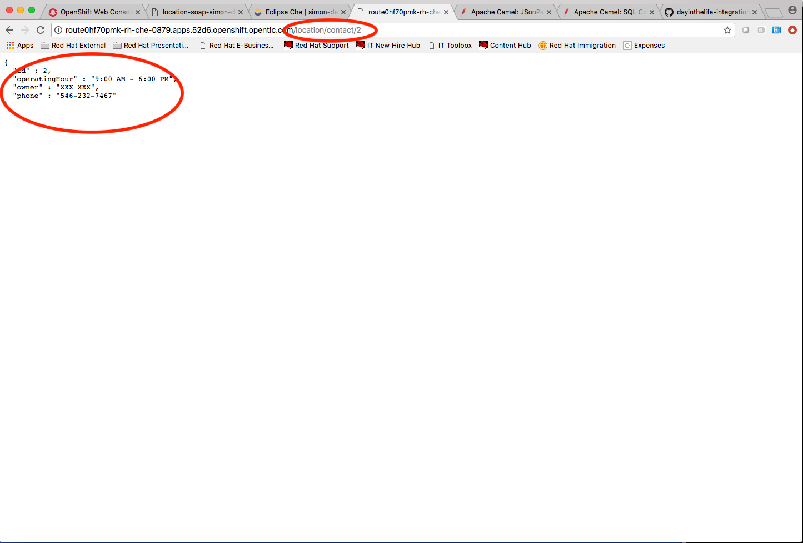
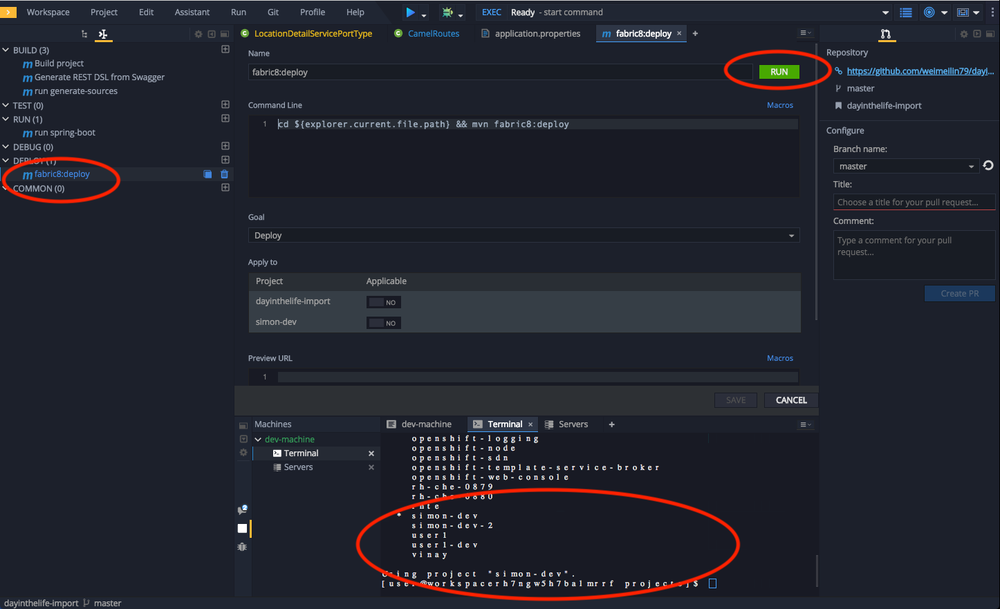

// Attributes
:walkthrough: SOAP TO REST
:title: Lab 5 - {walkthrough}
:user-password: openshift
:standard-fail-text: Verify that you followed all the steps. If you continue to have issues, contact a workshop assistant.
:namespace: {user-username}

// URLs
:che-url: http://che-che.{openshift-app-host}/

[id='soap-to-rest']
= Developer Lab 4 - SOAP to REST Transformation

In this lab, we will be using existing legacy SOAP service and wrap it with a new RESTful endpoint

Audience: Developers, Architects

*Overview*

Another important use case in developing API's is to take an existing legacy SOAP service and wrap it with a new RESTful endpoint.  This SOAP to REST transformation is implemented in the API service layer (Fuse).  This lab will walk you through taking an existing SOAP contract (WSDL), converting it to Java POJO's and exposing it using Camel REST DSL.

In order to be able to accomplish the SOAP to REST task we will need to follow those steps:

. Generate the stubs using **cxf-codegen** through a **Maven** plugin
. Build a Camel Route to use it 
. Deploy into OCP

*Why Red Hat?*

CodeReady Workspaces, our online IDE, provides important functionality for implementing API services. In this lab you can see how our CodeReady Workspaces and Fuse can help with SOAP to REST transformation on OpenShift.

*Skipping The Lab*

If you are planning to follow to the next lab or are having trouble with this lab, you can reference the working project link:{https://github.com/hodrigohamalho/dayinthelife-streams/tree/master/projects/location-soap2rest}[here]

*Credentials*

Use the following credentials to login into the web consoles:

* Your *username* is: `{user-username}`
* Your *password* is: `{user-password}`

For the 3Scale API Management you are going to use *redhat* as password.

[type=walkthroughResource]
.Che
****
* link:{che-url}/[Open Eclipse Che, window="_blank"]
****

[type=walkthroughResource,serviceName=openshift]
.Openshift
****
* link:{openshift-host}/[Open Console, window="_blank"]
****

:sectnums:

[time=5]
[id="getting-ready"]
== Eclipse Che Workspace and Setup the environment
. To provision Eclipse Che Workspace, navigate to Eclipse Che console: {che-url}[Eclipse Che, window="_blank", id="{context}-3"]

. Login to Che using your credentials (`{user-username}` and `{user-password}`).
+

. **Stop** the running workspace.
+

. Let's create a new one. Click the **Create Workspace** button to open your workspace. And paste the following content
+

[source,yaml,subs="attributes+"]
----
apiVersion: 1.0.0
metadata:
  generateName: dil-streaming-
projects:
  -
    name: soap2rest
    source:
      type: git
      location: "https://github.com/hodrigohamalho/fuse-soap-2-rest"
components:
  -
    type: chePlugin
    id: redhat/vscode-xml/latest
  -
    type: chePlugin
    id: redhat/vscode-apache-camel/latest
  -
    type: chePlugin
    id: redhat/java/latest
  - 
    type: dockerimage
    alias: maven
    image: 'quay.io/eclipse/che-java8-maven@sha256:348edafc2935bb8a8f4b7d1d95e9155581f9557b8c7a9a68b0ad0263bf77fa16'
    env:
      - name: MAVEN_CONFIG
        value: ''
      - name: MAVEN_OPTS
        value: '-XX:MaxRAMPercentage=50.0 -XX:+UseParallelGC -XX:MinHeapFreeRatio=10 -XX:MaxHeapFreeRatio=20 -XX:GCTimeRatio=4 -XX:AdaptiveSizePolicyWeight=90 -Dsun.zip.disableMemoryMapping=true -Xms20m -Djava.security.egd=file:/dev/./urandom'
      - name: JAVA_OPTS
        value: '-XX:MaxRAMPercentage=50.0 -XX:+UseParallelGC -XX:MinHeapFreeRatio=10 -XX:MaxHeapFreeRatio=20 -XX:GCTimeRatio=4 -XX:AdaptiveSizePolicyWeight=90 -Dsun.zip.disableMemoryMapping=true -Xms20m -Djava.security.egd=file:/dev/./urandom'
      - name: JAVA_TOOL_OPTIONS
        value: '-XX:MaxRAMPercentage=50.0 -XX:+UseParallelGC -XX:MinHeapFreeRatio=10 -XX:MaxHeapFreeRatio=20 -XX:GCTimeRatio=4 -XX:AdaptiveSizePolicyWeight=90 -Dsun.zip.disableMemoryMapping=true -Xms20m -Djava.security.egd=file:/dev/./urandom'
    volumes:
      - name: m2
        containerPath: /home/user/.m2
    memoryLimit: 512Mi
    endpoints:
      - name: 8080-tcp
        port: 8080
    mountSources: true
  -
    type: dockerimage
    alias: tools
    image: quay.io/weimeilin79/java8tools:latest
    memoryLimit: 768Mi
    endpoints:
      - name: '8080/tcp'
        port: 8080
  - 
    alias: vscode-camelk
    type: chePlugin
    reference: https://raw.githubusercontent.com/RedHatWorkshops/dayinthelife-streaming/master/support/che/meta.yaml
commands:
  - name: build the project
    actions:
      - type: exec
        component: maven
        command: mvn clean install
        workdir: '${CHE_PROJECTS_ROOT}/soap2rest/location-soap2rest'
  - name: Generate source from WSDL
    actions:
      - type: exec
        component: maven
        command: mvn generate-sources
        workdir: '${CHE_PROJECTS_ROOT}/soap2rest/location-soap2rest'
  - name: run the services
    actions:
      - type: exec
        component: maven
        command: 'mvn spring-boot:run -DskipTests'
        workdir: '${CHE_PROJECTS_ROOT}/soap2rest/location-soap2rest'
  - name: run the services (debugging enabled)
    actions:
      - type: exec
        component: maven
        command: 'mvn spring-boot:run -DskipTests -Drun.jvmArguments="-Xdebug -Xrunjdwp:transport=dt_socket,server=y,suspend=n,address=5005"'
        workdir: '${CHE_PROJECTS_ROOT}/soap2rest/location-soap2rest'
  - name: Debug remote java application
    actions:
      - type: vscode-launch
        referenceContent: |
          {
          "version": "0.2.0",
          "configurations": [
            {
              "type": "java",
              "name": "Debug (Attach) - Remote",
              "request": "attach",
              "hostName": "localhost",
              "port": 5005
            }]
          }
----

. You’ll be placed in the workspace. Close the initial welcome and Readme tabs then click on the Explorer button on the left side bar.

. Click the **Workspace** button and open the `soap2rest/location-soap2rest` folder.
+

. Select **Terminal > Open Terminal in specific container** and select the container that begins with `dil-` (followed by a 5-digit alphanumeric code).  Click it and a terminal window should open.
+

=== Login into the OpenShift cluster

. Finally, you will need to login into the OpenShift CLI to start interacting with the platform. For login, issue the following command:
+
[source,bash,subs="attributes+"]
----
oc login -u {user-username} -p {user-password} https://$KUBERNETES_SERVICE_HOST:$KUBERNETES_SERVICE_PORT --insecure-skip-tls-verify=true
----

. You should see something like the following (the project names may be different):
+
----
Login successful.

You have access to the following projects and can switch between them with 'oc project <projectname>':

    shared-db-earth
    shared-kafka-earth
  * user1
    user1-che
    user1-dayinthel-0605
    user1-shared-475f

Using project "user1".
Welcome! See 'oc help' to get started.
----

. Most of the work will be deploy to your own `{namespace}` project namespace, so be sure to have it as a _working_ project by executing the following command:
+
[source,bash,subs="attributes+"]
----
oc project {namespace}
----

. Navigate to the {openshift-host}[OpenShift Developer Console, window="_blank", id="{context}-3"] and login with your OpenShift credentials (`{user-username}` and `{user-password}`).

. Click on the the Topology view (left side menu)
+

[id="instructions"]
== Import the sample SOAP project into your Openshift project

. Build and deploy the SOAP application using source to image(S2i) template. Paste the commend to the terminal.
+
[source,bash,subs="attributes+"]
----
 oc new-app s2i-fuse71-spring-boot-camel -p GIT_REPO=https://github.com/RedHatWorkshops/dayinthelife-integration -p CONTEXT_DIR=/projects/location-soap -p APP_NAME=location-soap -p GIT_REF=master -n {user-username}
----

. Once the build and deploy is complete, navigate back to your Openshift web console and verify the project is running.
+

[type=verification]
Were you able to build and deploy the SOAP application?

[type=verificationFail]
Try to redo this section, if any problem persists have your instructor check the Kubernetes pod that contains the SOAP application.

[time=5]
[id="instructions"]
== Modify the skeleton project

. In the OpenShift console, click on the route associated with the `location-soap` deployment.  A pop-up will appear.  Append the `/ws/location?wsdl` path to the URI and verify the WSDL appears. Copy the link to the clipboard.
+

. (Optional) If you would like to test the web service, you can do using a WSDL client, like *SOAP UI*. Look at the result on the right.
+

. Now we are going to work in a Java project in order to convert this to REST.
+

. Return to your CodeReady workspace and open the `location-soap2rest` project.  Open the `pom.xml` file and scroll to the bottom.  Uncomment out the `cxf-codegen-plugin` entry at the bottom.  Update the `<wsdl>` entry with your fully qualified WSDL URL: `http://location-soap-{user-username}.{user-username}.svc:8080/ws/location?wsdl`
+

. We now need to generate the POJO objects from the WSDL contract. To do this, change to the *Manage commands* view.

. Open the *Terminal* and run `mvn generate-sources`. And look for the **BUILD SUCCESS** message on the console and the *POJO* classes generated under redhat package.
+

[type=verification]
Were you able to generate the POJO classes?

[type=verificationFail]
Try to redo this section, if any problem persists have your instructor check the Kubernetes pod that contains the CodeReady Workspaces application.

[time=10]
[id="instructions-camel-route"]
== Update the Camel Route

. Open up the `CamelRoutes.java` file.  Notice that the existing implementation is barebones. First of all, we need to enter the SOAP service address and WSDL location for our CXF client to call.
+
[source,java,subs="attributes+"]
----
 ...

 @Autowired
 private CamelContext camelContext;

 @Override
 public void configure() throws Exception {

 ...

----

. Secondly, we need to create our Camel route implementation and create the RESTful endpoint(still in the `CamelRoutes.java` file). Make sure the values to (`cxf://` URL): are correct
+
[source,java,subs="attributes+"]
----

 ...

    rest("/location").description("Location information")
      .produces("application/json")
      .get("/contact/{id}").description("Location Contact Info")
        .responseMessage().code(200).message("Data successfully returned").endResponseMessage()
        .to("direct:getalllocationphone");

    from("direct:getalllocationphone")
      .setBody().simple("${headers.id}")
      .unmarshal().json(JsonLibrary.Jackson)
      .to("cxf://http://location-soap-{user-username}.{openshift-app-host}/ws/location?serviceClass=com.redhat.LocationDetailServicePortType&defaultOperationName=contact")
      .process(
        new Processor(){
          @Override
          public void process(Exchange exchange) throws Exception {
            MessageContentsList list = (MessageContentsList)exchange.getIn().getBody();
            exchange.getOut().setBody((ContactInfo)list.get(0));
          }
      });
     
----

. Now that we have our API service implementation, we can try to test this locally.  Navigate back to the *Manage commands* view and execute the `run spring-boot` script.  Click the *Run* button.
+
image::images/00-local-testing.png[00-local-testing.png, role="integr8ly-img-responsive"]

. Once the application starts, navigate to the Servers window and click on the URL corresponding to port 8080.  A new tab should appear:
+
image::images/00-select-servers.png[00-select-servers.png, role="integr8ly-img-responsive"]

. In the new tab, append the URL with the following URI: `/location/contact/2`.  A contact should be returned:
+

. Now that we've successfully tested our new SOAP to REST service locally, we can deploy it to OpenShift.  Stop the running application by clicking *Cancel*.
. Open the `fabric8:deploy` script and hit the *Run* button to deploy it to OpenShift.
+

. If the deployment script completes successfully, navigate back to your Openshift web console and verify the pod is running
+

. Click on the route link above the location-soap2rest pod and append `/location/contact/2` to the URI.  As a result, you should get a contact back.

[type=verification]
Were you able to retrieve a contact?

[type=verificationFail]
Try to redo this section, if any problem persists have your instructor check the Kubernetes pod that contains the CodeReady Workspaces application.

_Congratulations!_ You have created a SOAP to REST transformation API.

[time=2]
[id="summary"]
== Overview

You have now successfully created a contract-first API using a SOAP WSDL contract together with generated Camel RESTdsl.

You can now proceed to link:{next-lab-url}[Lab 5].